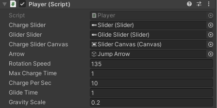

# Jumping with Arrow [Unity Game Engine]
## This code is for jumping with a rotating arrow and also gliding

You can charge the ball with holding **left mouse button** and throw it with releasing.
If you hold **left mouse button** when flying, you can glide for a while.

Player script in Player game object should be as below at first.

